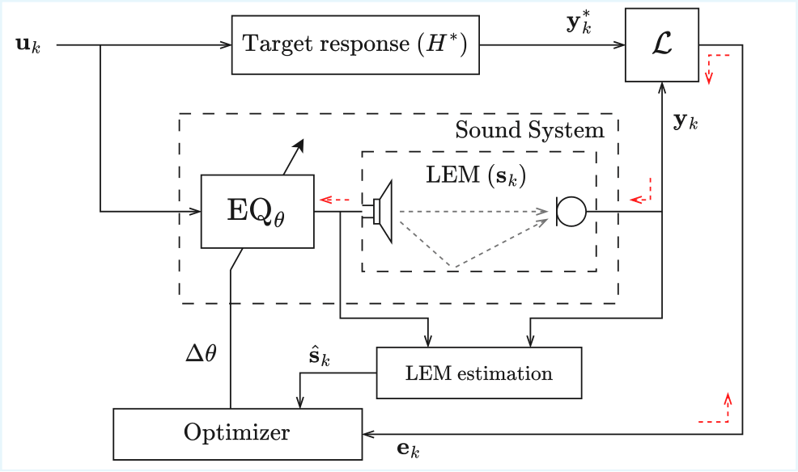

# A DDSP Framework for Adaptive Room Equalization

Code accompanying the paper submitted to DAFx26:

> **A DDSP Framework for Adaptive Room Equalization**  
> Fernando Marcos-Macías

---

## Overview

This repository implements a differentiable digital signal processing (DDSP) framework for adaptive room equalization (ARE). A 7-band parametric EQ is optimized frame-by-frame to compensate for the room's frequency response using gradient-based methods. The framework supports several optimizers (SGD, Adam, Newton, iHAM-1 through iHAM-3) and two loss types (FD-MSE, TD-MSE) and is compared against classical FIR adaptive filters (FxLMS, FxFDAF). The implementation is fully modular, so ay of these elements---equalizer structure, live room response estimation method, loss function and optimizer---may be replaced to test the effectiveness of the adaptive room equalization framework.

<p align="center">
  
</p>
<p align="center"><em>Figure 1. Block diagram of the proposed DDSP adaptive room equalization framework.</em></p>

<p align="center">
  
</p>
<p align="center"><em>Figure 2. Example animation of the adaptive parametric EQ evolution over time on a time-varying acoustic scenario.</em></p>

---

## Repository Structure

```
DDSP-adaptive-EQ-26/
├── configs/                        # JSON experiment configuration files
│   ├── main_experiment_config.json
│   ├── ablation_study_config.json
│   └── example_config.json
├── data/
│   ├── MedleyDB/                   # Full-track music mixes (excitation signals)
│   └── SoundCam/
│       ├── moving_listener/        # RIRs: moving listener position scenario
│       └── moving_person/          # RIRs: moving person scenario  
├── results/
│   └── <experiment_name>/          # One directory per experiment (auto-created)
│       ├── audio/                  # Per-run EQ-processed WAV files
│       ├── config.json             # Config used to produce these results
│       ├── plot_data.pkl           # Serialised curve data for plotting
│       └── metrics.csv             # Per-file audio quality metrics
├── figs/                           # Saved figures and animations
├── src/
│   ├── external/
│   │   ├── local_dasp_pytorch/     # DDSP building blocks (ParametricEQ, biquads, …)
│   │   └── local_pyaec/            # FxLMS / FxFDAF adaptive filter implementations
│   ├── modules/
│   │   └── modules.py              # LEMConv (custom autograd) and Ridge regression
│   ├── scripts/
│   │   ├── main_experiment.py      # Full grid-search experiment runner
│   │   ├── ablation_study.py       # Ablation study with FIR baseline comparison
│   │   ├── plot_results_main_experiment.py
│   │   ├── plot_results_ablation_study.py
│   │   ├── metrics_eval.py         # Audio quality metrics evaluation
│   │   ├── example.py              # Minimal single-run example
│   │   └── explore_data.ipynb      # Interactive data exploration notebook
│   └── utils/
│       ├── common.py               # Core signal processing and experiment loop
│       ├── main.py                 # Grid construction and I/O helpers for main experiment
│       ├── ablation.py             # FIR baseline wrappers and ablation helpers
│       ├── plotting.py             # Shared plotting utilities
│       └── metrics.py              # Audio quality metrics (RMSE, SI-SDR, LUFS-diff)
└── requirements.yml                # Conda environment specification
```

---

## Installation

```bash
conda env create -f requirements.yml
conda activate ddsp-are
```

---

## Data

### SoundCam RIRs

Place the SoundCam room impulse responses under:

```
data/SoundCam/moving_listener/   ← moving listener position scenario
data/SoundCam/moving_person/     ← moving person scenario
```

Each directory should contain `*.wav` or `*.npy` RIR files in order of recording position.

### MedleyDB

Place full-track music WAV/MP3 files under:

```
data/MedleyDB/
```

---

## Quick Start

Run the minimal example (white noise, single RIR, 30 s):

```bash
python src/scripts/example.py --config configs/example_config.json
```

Run the full main experiment:

```bash
python src/scripts/main_experiment.py --config configs/main_experiment_config.json
```

Run the ablation study:

```bash
python src/scripts/ablation_study.py --config configs/ablation_study_config.json
```

Plot results:

```bash
python src/scripts/plot_results_main_experiment.py --experiment main_experiment
python src/scripts/plot_results_ablation_study.py --experiment ablation_study
```

Evaluate metrics on saved audio:

```bash
python src/scripts/metrics_eval.py --experiment main_experiment
```

---

## Configuration

Each experiment is controlled by a JSON config file in `configs/`. Key fields:

| Field | Description |
|---|---|
| `experiment_name` | Output directory name under `results/` |
| `scenario` | `"moving_position"`, `"moving_person"`, or `"static"` |
| `simulation_params.frame_len` | Analysis frame length in samples |
| `simulation_params.loss_type` | `"FD-MSE"` or `"TD-MSE"` |
| `simulation_params.optim_type` | `"SGD"`, `"iHAM-1"` … `"iHAM-3"`, `"Newton"` |
| `simulation_params.mu_opt` | Step size (per-optimizer or per-loss-type dict) |
| `input.max_num_songs` | Maximum number of MedleyDB songs to include |

---

## Citation

<!-- Citation not yet available: paper is currently under review for publication. -->

<!--
```bibtex
@inproceedings{marcos2026ddsp,
  title     = {A {DDSP} Framework for Adaptive Room Equalization},
  author    = {Marcos-Mac{\'{i}}as, Fernando},
  booktitle = {Proceedings of the 27th International Conference on Digital Audio Effects (DAFx26)},
  year      = {2026}
}
```
-->
