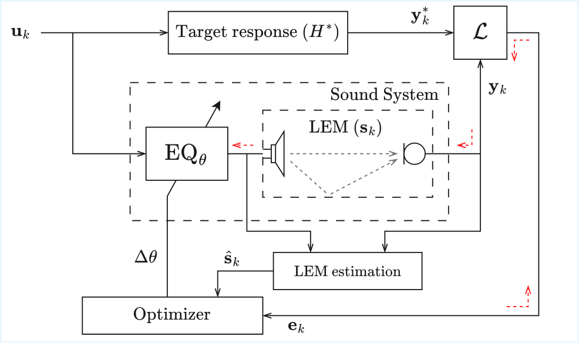
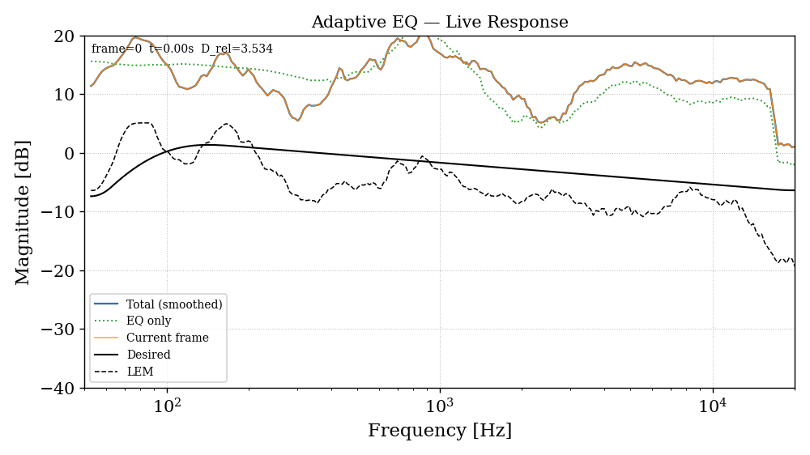
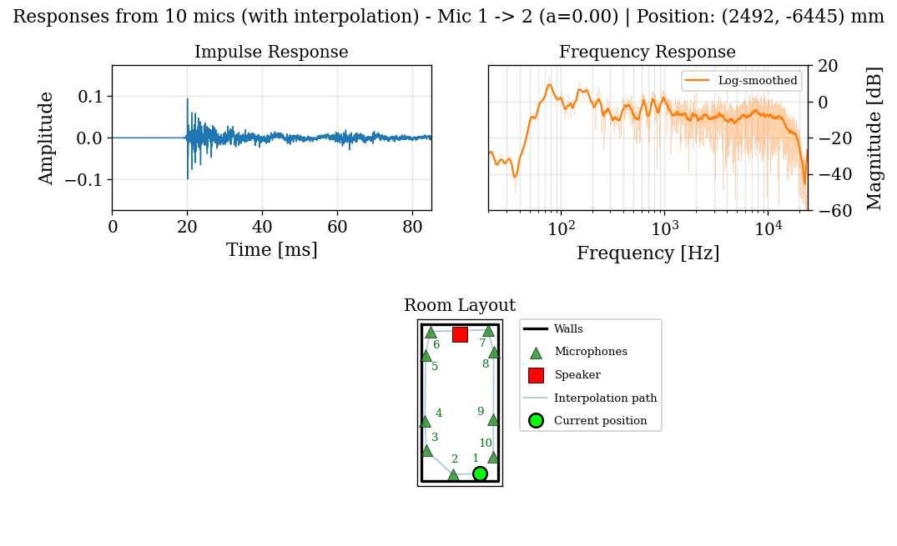

# A DDSP Framework for Adaptive Room Equalization

Code accompanying the DAFx-26 paper:

> **A DDSP Framework for Adaptive Room Equalization**  
> Fernando Marcos-Macías, María Pilar Daza-Llin, Mateo Cámara, and José Luis Blanco

---

## Overview

This repository implements a differentiable digital signal processing (DDSP) framework for adaptive room equalization (ARE). A 7-band parametric EQ is optimized frame-by-frame to compensate for the room's frequency response using gradient-based methods. The framework supports several optimizers (SGD, Adam, Newton, iHAM-1 through iHAM-3) and two loss types (FD-MSE, TD-MSE) and is compared against classical FIR adaptive filters (FxLMS, FxFDAF). The implementation is fully modular, so any of these elements---equalizer structure, live room response estimation method, loss function and optimizer---may be replaced to test the effectiveness of the adaptive room equalization framework.

<br><br>

<p align="center">
  
</p>
<p align="center"><em>Figure 1. Block diagram of the proposed DDSP adaptive room equalization framework.</em></p>

<br><br>

<p align="center">
  
</p>
<p align="center"><em>Figure 2. Example animation of the adaptive parametric EQ evolution over time on a time-varying acoustic scenario.</em></p>

<br><br>

---

## Repository Structure

```
DDSP-adaptive-EQ-26/
├── configs/                        # JSON experiment configuration files
│   ├── main_experiment_config.json
│   ├── ablation_study_config.json
│   └── example_config.json
├── data/
│   ├── MedleyDB/                   # Full-track music mixes (excitation signals)
│   └── SoundCam/
│       ├── moving_listener/        # RIRs: moving listener position scenario
│       └── moving_person/          # RIRs: moving person scenario  
├── results/
│   └── <experiment_name>/          # One directory per experiment (auto-created)
│       ├── audio/                  # Per-run EQ-processed WAV files
│       ├── config.json             # Config used to produce these results
│       ├── plot_data.pkl           # Serialised curve data for plotting
│       └── metrics.csv             # Grouped audio quality metrics
├── figs/                           # Saved figures and animations
├── src/
│   ├── external/
│   │   ├── local_dasp_pytorch/     # DDSP building blocks (ParametricEQ, biquads, …)
│   │   └── local_pyaec/            # FxLMS / FxFDAF adaptive filter implementations
│   ├── modules/
│   │   └── modules.py              # LEMConv (custom autograd) and Ridge regression
│   ├── scripts/
│   │   ├── main_experiment.py      # Full grid-search experiment runner
│   │   ├── ablation_study.py       # Ablation study with FIR baseline comparison
│   │   ├── plot_results_main_experiment.py
│   │   ├── plot_results_ablation_study.py
│   │   ├── metrics_eval.py         # Audio quality metrics evaluation
│   │   ├── example.py              # Minimal single-run example
│   │   └── explore_data.ipynb      # Interactive data exploration notebook
│   └── utils/
│       ├── common.py               # Core signal processing and experiment loop
│       ├── main.py                 # Grid construction and I/O helpers for main experiment
│       ├── ablation.py             # FIR baseline wrappers and ablation helpers
│       ├── plotting.py             # Shared plotting utilities
│       └── metrics.py              # Audio quality metrics (RMSE, SI-SDR, LUFS-diff)
└── requirements.yml                # Conda environment specification
```

---

## Installation

Create the Conda environment from the repository root:

```bash
conda env create --name ddsp-are --file requirements.yml
conda activate ddsp-are
```

The supplied environment targets Python 3.10, PyTorch 2.1 or newer, and CUDA 12.1. At runtime, the experiment code uses a CUDA device when PyTorch detects one and otherwise falls back to CPU. Higher-order optimizers, long signals, large frames, and large parameter grids can be computationally expensive.

All commands below assume that the current working directory is the repository root. This is particularly important for relative paths such as `data/MedleyDB/<track>.wav` in configuration files.

---

## Data

### SoundCam RIRs

A subset of the 48 kHz conference-room impulse responses from the [SoundCam dataset](https://proceedings.neurips.cc/paper_files/paper/2023/hash/a4289154c9209b679ac761a50d5fec3a-Abstract-Datasets_and_Benchmarks.html) is included in:

```
data/SoundCam/moving_listener/   <- moving listener position scenario
data/SoundCam/moving_person/     <- moving person scenario
```

The scenario name in a configuration selects the RIR directory as follows:

| `scenario` | RIR sequence | Interpretation |
|---|---|---|
| `"moving_position"` | `data/SoundCam/moving_listener/` | The source is fixed and the listener/microphone position changes. |
| `"moving_person"` | `data/SoundCam/moving_person/` | The source and listener remain fixed while the occupant position changes. |
| `"static"` | First RIR in `moving_listener/` | A time-invariant control case; the runners force `n_rirs = 1`. |

Each directory contains position-indexed `*.wav` files. They are sorted by filename and the first `n_rirs` responses are loaded. For time-varying scenarios, the responses are distributed over the signal duration and interpolated during each transition interval. The following animation shows the conference-room layout and the response sequence used for the moving-listener case.

<br><br>

<p align="center">
  
</p>
<p align="center"><em>Figure 3. Room layout (bottom) and resulting impulse (top left) and magnitude (top right) responses for a moving listener position.</em></p>

<br><br>

### MedleyDB

The music evaluation reported in the paper uses **10 full-track mixes from the [MedleyDB dataset](https://medleydb.weebly.com/downloads.html)**. Each track is truncated to 180 seconds for the reported experiments; files at 44.1 kHz are resampled to the SoundCam RIR sampling rate of 48 kHz by the loader. The selected full mixes are placed in:

```
data/MedleyDB/
```

This directory is an input pool rather than a hard-coded track list. Researchers can add or replace tracks without changing the code. When `input.use_songs_folder` is enabled, the runner discovers the regular files directly under `data/MedleyDB/`, sorts them by name, and either uses all of them or selects `input.max_num_songs` tracks using the configured random seed. Audio is downmixed to mono when necessary, resampled to the RIR sampling rate, peak-normalized, and optionally truncated according to `input.max_audio_len_s`.

Keep only audio files supported by `torchaudio` in this directory; the discovery function does not filter by extension. The checkout may contain additional MedleyDB mixes beyond the ten-track evaluation subset, and newly added tracks automatically become eligible for future experiments.

### Dataset references

If you use the included data, please cite the original datasets in addition to this work:

- M. Wang, S. Clarke, J.-H. Wang, R. Gao, and J. Wu, “SoundCam: A Dataset for Finding Humans Using Room Acoustics,” *Advances in Neural Information Processing Systems*, vol. 36, 2023.
- R. M. Bittner, J. Salamon, M. Tierney, M. Mauch, C. Cannam, and J. P. Bello, “MedleyDB: A Multitrack Dataset for Annotation-Intensive MIR Research,” in *Proceedings of the 15th International Society for Music Information Retrieval Conference (ISMIR)*, 2014, pp. 155–160.

---

## How the Implementation Maps to the Paper

The main simulation logic is implemented by `utils.common.run_control_experiment`. Both experiment runners and the minimal example prepare a configuration and input descriptor, then call this method. It contains the complete frame-by-frame adaptive equalization loop:

1. Load the selected SoundCam RIRs and construct the time-varying acoustic scenario.
2. Derive the desired response from the initial RIR: a pure delay or the paper's delay-plus-magnitude target with low-frequency roll-off and distance-dependent spectral decay.
3. Instantiate the differentiable seven-biquad parametric EQ and output gain. The EQ architecture is fixed in the current implementation: one low shelf, five peaking filters, and one high shelf.
4. Load a music signal or synthesize white noise, convert it to the RIR sampling rate, and divide it into frames.
5. For each frame, update the true RIR, process the signal through the EQ and sound-system model, estimate the live loudspeaker-enclosure-microphone (LEM) block by regularized frequency-domain deconvolution, evaluate the configured loss, backpropagate through the LEM estimate, and update the EQ parameters.
6. Record the loss, validation error, timing, optional EQ checkpoints, final parameters, and input/desired/unprocessed/equalized audio.

The validation curve is the paper's normalized relative system distance, `D_rel`: the L1 spectral distance from the equalized response to the desired response, normalized by the corresponding distance for the unprocessed room response. Thus, `D_rel = 1` represents no improvement over the room alone, values below 1 represent improvement, and 0 is a perfect match under this measure.

The configuration uses the historical `GHAM-J` identifiers for the methods named **iHAM-J** in the paper and figures. Plotting utilities automatically replace `GHAM` with `iHAM` in display labels.

---

## Quick Start

### 1. Run the minimal example

`example.py` is the fastest way to inspect one specific configuration. It runs a single input and optimizer, prints the final validation error, and opens the validation and final-response plots. The optional live debug plot can also save the evolving response as a GIF. Unlike the experiment runners, it does not create a complete result bundle under `results/`.

```bash
python src/scripts/example.py --config configs/example_config.json
```

The supplied example uses one MedleyDB track, three moving-listener RIRs, FD-MSE, and `GHAM-1` (iHAM-1). Set `input.use_white_noise` to `true` for a synthetic excitation instead.

### 2. Run a parameter-grid experiment

`main_experiment.py` expands `simulation_params` into a grid, runs every resolved configuration on the selected music tracks and/or white-noise realizations, aggregates validation and loss curves, measures computation time, and saves processed audio.

```bash
python src/scripts/main_experiment.py --config configs/main_experiment_config.json
```

Outputs are written to `results/<experiment_name>/` using the `experiment_name` in the JSON file.

### 3. Run the ablation and FIR-baseline comparison

`ablation_study.py` runs each entry in `proposed_configs` under every shared simulation setting, then evaluates the enabled FxLMS and FxFDAF baselines on the same inputs and RIR sequences. It saves time-domain MSE, relative system-distance curves, final-response data, computation times, and audio.

```bash
python src/scripts/ablation_study.py --config configs/ablation_study_config.json
```

### 4. Plot a completed experiment

The plotting scripts read `config.json` and `plot_data.pkl` from the named result directory. The main-experiment plotter saves validation and loss figures and prints per-frame computation statistics; the ablation plotter saves the TD-MSE, relative-distance, and final-response comparison.

```bash
python src/scripts/plot_results_main_experiment.py --experiment main_experiment
python src/scripts/plot_results_ablation_study.py --experiment ablation_study
```

Both scripts save PNG files inside `results/<experiment_name>/` and also call `plt.show()` for interactive inspection.

### 5. Evaluate saved audio

`metrics_eval.py` finds `EQ_*.wav` files, pairs each with its `desired_<track>.wav` reference, delays the reference by the repository's fixed 300-sample evaluation offset, adds a shared `1e-8` dither for numerical stability, computes metrics per file, and saves grouped mean and standard-deviation values to `metrics.csv`.

```bash
python src/scripts/metrics_eval.py --experiment main_experiment
```

Select metrics explicitly or evaluate only the final portion of each signal:

```bash
python src/scripts/metrics_eval.py \
  --experiment main_experiment \
  --metrics MRSTFT MSD Spectral-Centroid RMSE SI-SDR LUFS-diff \
  --eval-last-s 150
```

Accepted metric names are `PEAQ`, `MRSTFT` (or its `STFT` alias), `MSD`, `Spectral-Centroid` (or `Spectral Centroid` when passed as one quoted argument), `RMSE`, `SI-SDR`, and `LUFS-diff`. PEAQ is considerably slower on long files. `PEAQ`, `MSD`, and `Spectral-Centroid` rely on optional packages (`aquatk`, `mel_cepstral_distance`, and `librosa`, respectively) that are not installed by `requirements.yml`; unavailable metrics are reported as `NaN` rather than aborting the evaluation.

---

## Configuration

Configuration files are ordinary JSON. The three supplied files serve different purposes:

- `configs/example_config.json` contains scalar values for one interactive run.
- `configs/main_experiment_config.json` contains lists that define a parameter grid.
- `configs/ablation_study_config.json` separates a shared grid, proposed-method variants, and FIR baselines.

### Top-level fields

| Field | Type and accepted values | Meaning |
|---|---|---|
| `experiment_name` | Non-empty string | Output subdirectory under `results/`. Use a new name for each experiment to avoid overwriting result files or mixing them with stale audio. The minimal example does not otherwise use this field. |
| `seed` | Integer | Seeds Python, NumPy, and PyTorch. For white noise, each realization adds a deterministic seed offset. The same seed also makes song subsampling repeatable. |
| `scenario` | `"moving_position"`, `"moving_person"`, or `"static"` | Selects the RIR directory. `"static"` forces one RIR regardless of the configured `n_rirs`. |

### Main experiment: `simulation_params`

Every field in `main_experiment_config.json` is a list of candidate values unless noted otherwise. The runner takes the Cartesian product of the ordinary fields. `optim_type` and `mu_opt` are the exception: they are paired by position, so their lists must have the same length.

| Field | Type and accepted values | Meaning |
|---|---|---|
| `ROI` | List of `[f_min, f_max]` pairs in Hz, for example `[[50.0, 20000.0]]` | Frequency region used for target design, response estimation, loss evaluation, and validation. Use `0 < f_min < f_max <= sample_rate / 2`; the included SoundCam RIRs use 48 kHz audio. |
| `frame_len` | List of positive integers | Frame length in samples. It controls frequency resolution, update rate, memory use, and computational cost. The main runner always sets `hop_len = frame_len`, so frames do not overlap. The paper's principal setting is 8192 samples. |
| `forget_factor` | List of floats in `[0, 1]` | Weight of the newest response estimate in the exponential moving average. Higher values adapt faster but provide less smoothing. The paper uses `0.05`. |
| `target_response_type` | `"delay_only"` or `"delay_and_mag"` | `"delay_only"` creates an impulse target. `"delay_and_mag"` uses the compensation magnitude response derived from the initial RIR and adds the measured propagation delay; this is the paper's target. |
| `n_rirs` | List of positive integers | Number of filename-sorted RIRs to load. Use no more than are present in the selected scenario directory. Values above 1 create a time-varying scenario. |
| `transition_time_s` | List of non-negative numbers | Duration, in seconds, of the interpolation between consecutive RIRs. Transitions begin at evenly spaced segment boundaries. For cleanly separated transitions, keep this no greater than `max_audio_len_s / n_rirs`. It has no effect with one RIR. |
| `loss_type` | `"FD-MSE"`, `"TD-MSE"`, `"FD-SE"`, or `"TD-SE"` | Frequency- or time-domain mean-squared error (`MSE`) or unreduced squared error (`SE`). The reported music experiments primarily use `"FD-MSE"`; the paper shows that time-domain objectives are less robust for nonstationary music. |
| `optim_type` | List containing `"SGD"`, `"Adam"`, `"Newton"`, `"GHAM-1"`, `"GHAM-2"`, and/or `"GHAM-3"` | Optimizer used for each frame. `GHAM-J` is the configuration spelling of iHAM-J. `GHAM-4` is not an accepted runnable option: the code explicitly raises `NotImplementedError`. |
| `mu_opt` | List of positive numbers, or object mapping each loss type to such a list | Per-optimizer update size. Each list must match `optim_type` in length and is paired positionally. A per-loss object such as `{"FD-MSE": [0.005, 0.05]}` allows different step sizes for different losses. |
| `lambda_newton` | List, or object mapping loss types to one-element lists/scalars; non-negative | Diagonal Hessian regularization used by `"Newton"`. It is accepted for all runs but ignored by the other optimizers. |
| `eps_0` | List, or object mapping loss types to one-element lists/scalars; non-negative | Irreducible-error level in the GHAM/iHAM deformation equation. It affects `GHAM-1` through `GHAM-3` and is ignored by SGD, Adam, and Newton. |
| `use_true_LEM` | List of booleans | If `false`, gradients use the online LEM estimate, matching the main experiments. If `true`, gradients use the ground-truth current RIR; this supports the LEM-estimation ablation. The physical forward path always uses the true simulated RIR. |
| `n_checkpoints` | List of non-negative integers | Number of intermediate EQ-response snapshots. Initial and final snapshots are retained even when this is `0`; positive values add evenly spaced internal snapshots. |

For example, these entries run SGD with `mu = 0.005`, iHAM-1 with `mu = 0.05`, and Adam with `mu = 0.05`; they do **not** form nine optimizer/rate combinations:

```json
"optim_type": ["SGD", "GHAM-1", "Adam"],
"mu_opt": {
  "FD-MSE": [0.005, 0.05, 0.05]
}
```

### Main and ablation input fields

| Field | Type and accepted values | Meaning |
|---|---|---|
| `use_white_noise` | Boolean | Add synthetic white-noise runs. |
| `use_songs_folder` | Boolean | Add file-based runs discovered directly under `data/MedleyDB/`. Both input modes (white noise or songs) may be enabled together. Enable at least one mode. |
| `max_num_songs` | Positive integer or `null` | With songs, randomly select at most this many files; `null`, zero, or a value at least as large as the pool uses all files. With white noise, a positive value sets the number of independent realizations; `null` gives one. |
| `max_audio_len_s` | One-element list containing a positive number, for example `[180.0]` | Maximum duration per input. The grid runners currently read the first list element only. A numeric duration is required for white noise and for positioning transitions in a time-varying scenario. |

### Minimal example configuration

`example_config.json` uses scalar values rather than grid lists. Its `simulation_params` fields have the same meanings and accepted values as above. It may additionally specify `hop_len`; if omitted, the example sets it equal to `frame_len`.

The example's `input` object is different from the grid runners:

| Field | Type | Meaning |
|---|---|---|
| `use_white_noise` | Boolean | If `true`, synthesize noise. If `false`, load `song_path`. |
| `song_path` | String path | Required when `use_white_noise` is `false`. Relative paths are resolved from the current working directory. |
| `max_audio_len_s` | Positive number | Scalar maximum duration for this single run. |

Optional live-plot and GIF fields are held under `debug_plot`:

| Field | Accepted values | Meaning |
|---|---|---|
| `enabled` | Boolean | Enable the live validation/response visualization. |
| `update_every_frames` | Positive integer | Refresh the plot every N control frames. |
| `eq_smoothing_alpha` | Float in `[0, 1]` | Exponential smoothing weight for the displayed EQ curve; values are clipped to this range. |
| `save_gif` | Boolean | Save captured live-plot frames as a GIF. Requires `enabled: true`. |
| `gif_fps` | Positive integer | Playback frame rate; values below 1 are clamped to 1. |
| `gif_capture_every` | Positive integer | Capture every N live-plot callbacks; values below 1 are clamped to 1. |
| `gif_path` | String path ending in `.gif` | Output path for the animation. Parent directories are created automatically. |

### Ablation-study configuration

`shared_simulation_params` is a Cartesian-product grid. Its values must be lists, including `ROI` as a list of pairs. It supports `ROI`, `frame_len`, `hop_len`, `forget_factor`, `target_response_type`, `n_rirs`, and `transition_time_s` with the meanings above. Because the FIR baselines require non-overlapping frames, set `hop_len` equal to `frame_len`.

Each object in `proposed_configs` defines one adaptive-EQ variant:

| Field | Meaning |
|---|---|
| `label` | Unique display and filename label for this variant. |
| `optim_type`, `loss_type`, `mu_opt`, `lambda_newton`, `eps_0`, `use_true_LEM`, `n_checkpoints` | Scalar values with the same accepted values and meanings as the main experiment. |

`fir_baselines` accepts `FxLMS` and `FxFDAF` objects:

| Field | Baseline | Accepted values and meaning |
|---|---|---|
| `enabled` | Both | Boolean switch. Set it explicitly to `false` to skip the baseline. |
| `mu` | Both | Positive adaptation step size. |
| `filter_len` | Both | FIR controller length in samples; internally clamped to the range from 8 through `2 * frame_len`. |
| `primary_path_ir_len` | FxLMS | Positive integer limiting the primary-path impulse response used by the time-domain baseline. |
| `beta` | FxFDAF | Float conventionally in `[0, 1)` controlling frequency-domain smoothing/forgetting. |
| `block_size` | FxFDAF | Optional positive integer block size. It defaults to `filter_len` and is clamped from 8 through `frame_len`. |

### Designing and running a new experiment

1. Copy the closest supplied configuration to a new filename under `configs/`.
2. Set a unique `experiment_name`, for example `moving_person_fd_sweep`.
3. Change the scenario, input selection, and parameter lists. Keep `optim_type` and each corresponding `mu_opt` list the same length.
4. Run the appropriate experiment script with the new config path.
5. Pass the exact `experiment_name`—not the config filename—to the matching plotting script and to the metrics evaluator.

For a main-experiment variant:

```bash
cp configs/main_experiment_config.json configs/moving_person_fd_sweep.json
# Edit configs/moving_person_fd_sweep.json and set:
#   "experiment_name": "moving_person_fd_sweep"

python src/scripts/main_experiment.py --config configs/moving_person_fd_sweep.json
python src/scripts/plot_results_main_experiment.py --experiment moving_person_fd_sweep
python src/scripts/metrics_eval.py --experiment moving_person_fd_sweep
```

For an ablation variant, copy `ablation_study_config.json`, run `ablation_study.py`, and use `plot_results_ablation_study.py` with the new experiment name.

Reusing an existing `experiment_name` overwrites `config.json` and `plot_data.pkl` and may leave audio from older parameter combinations in the same directory. Prefer a fresh name, or manually archive/remove the old result directory before rerunning.

---

## Result Files

The full runners create the following artifacts:

| Path | Contents |
|---|---|
| `results/<experiment_name>/config.json` | Exact source configuration copied at the end of the run. |
| `results/<experiment_name>/plot_data.pkl` | Serialized curve, transition, checkpoint, response, and timing data consumed by the plotting scripts. |
| `results/<experiment_name>/audio/input_<track>.wav` | Input signal; produced by the main runner. |
| `results/<experiment_name>/audio/desired_<track>.wav` | Target-system output used as the metric reference. |
| `results/<experiment_name>/audio/noEQ_<track>.wav` | Simulated room output without equalization. |
| `results/<experiment_name>/audio/EQ_*.wav` | Equalized output for a specific optimizer/loss/frame/transition/input combination. |
| `results/<experiment_name>/<experiment_name>_curves.png` | Validation figure, or the combined ablation figure. |
| `results/<experiment_name>/<experiment_name>_loss_curves.png` | Main-experiment loss curves, when loss data are present. |
| `results/<experiment_name>/metrics.csv` | Per-optimizer and transition-time metric means and standard deviations. |

The runners print the fully resolved simulation configuration before each combination. For reproducibility, retain this console log together with the generated `config.json`, especially when reporting hardware-dependent computation times.

---

## Citation

If this repository contributes to your research, please cite:

```bibtex
@inproceedings{marcos2026ddsp,
  title     = {A {DDSP} Framework for Adaptive Room Equalization},
  author    = {Marcos-Mac{\'{i}}as, Fernando and Daza-Llin, Mar{\'{i}}a Pilar and C{\'{a}}mara, Mateo and Blanco, Jos{\'{e}} Luis},
  booktitle = {Proceedings of the 29th International Conference on Digital Audio Effects (DAFx-26)},
  address   = {Cambridge, MA, USA},
  year      = {2026}
}
```
